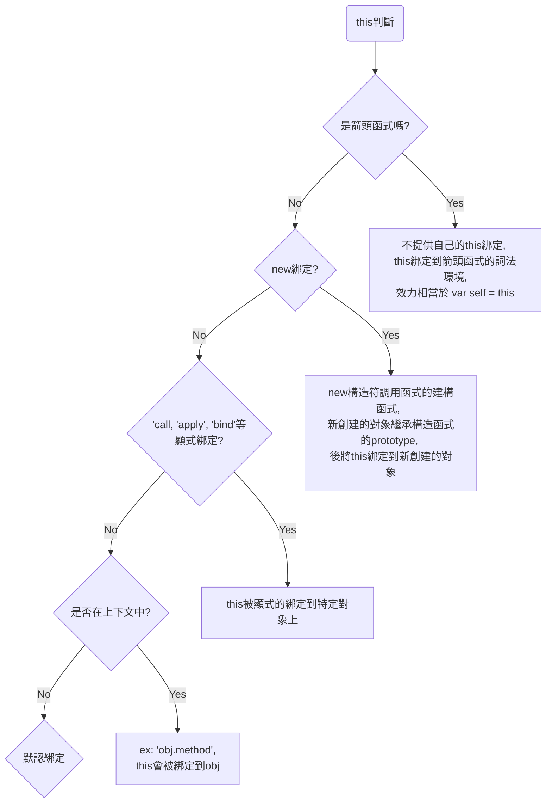

# Part2 this的對象原型
### 1. this是什麼
執行函式當前的上下文，其值取決於函式如何被調用，而不是在哪裡被宣告。
不同的調用方式，展示了this如何被設定。

查看調用位置 Chrome devtool → call stack

### 2. this的綁定方式
#### 2.1 默認綁定
不帶任何修飾的函數調用，沒有應用其它規則時的默認規則
```javascript
function foo() {
console.log( this.a ); // 調用時應用了默認綁定 this指向全局變數
}
var a = 2;
foo(); // 2
```
如果使用嚴格模式(strict mode)，默認綁定將無法使用全局對象
```javascript
function foo() {
"use strict";
console.log( this.a );
}
var a = 2;
foo(); // TypeError: this is undefined
```
**嚴格模式**
嚴格模式的目的是提高 JavaScript 程式碼的安全性和可讀性。
- 禁止使用未經聲明的變數
```javascript
"use strict";
x = 10;
// Uncaught ReferenceError: x is not defined
```
- 禁止重複定義變數
```javascript
function sum(a, a) {
  "use strict";
  return a + a;
}
// Uncaught SyntaxError: Duplicate parameter name not allowed in this context
```
- 不能使用 ‘with’ 語法
```javascript
const obj = {
  a: "aaaaaa",
  b: "bbbbbbbbb"
};
function testWith(obj) {
  "use strict";
  with (obj) {
    a = "uuuuuiiii";
  }
}
testWith(obj);
console.log(obj);
//SyntaxError: Strict mode code may not include a with statement
```

- 不能向不可寫的屬性賦值
```javascript
  'use strict';
  var obj = {};
  Object.defineProperty(obj, 'readOnly', { writable: false });
  obj.readOnly = 5; // 抛出错误：Cannot assign to read only property 'readOnly' of object '#<Object>'
```

- 不能刪除變量
```javascript
  function bb() {
    'use strict';
    var x = 3.14;
    delete x;
    console.log(x);
  }
  bb(); //SyntaxError: Delete of an unqualified identifier in strict mode.
```

- this的綁定
在嚴格模式下，this禁止指向全域，會返回undefined
```javascript
function ccc() {
  "use strict";
  console.log(this);
}
function ccc2() {
  console.log(this);
}
ccc(); //undefined
ccc2(); //window{...}
```

- arguments、eval、implements, interface, let, package, private, protected, public, static, yield， 一些會使用到的操作符不能作為變數名稱
```javascript
function ddd() {
  "use strict";
  const arguments = "wowowoo";
  console.log(arguments);
}
ddd(); //SyntaxError: Unexpected eval or arguments in strict mode
```

#### 2.2 隱式綁定
當函式被當作物件方法呼叫時(如："user.speak()")，this會被隱式綁定到那個物件
```javascript
const user = {
  name: 'Shubo',
  speak() {
    console.log('Hello world! My name is ' + this.name); // (1)
  }
};

user.speak(); // (2) Hello world! My name is Shubo
```
#### 2.3 顯式綁定
使用**call()，apply(), bind()**明確綁定函式內的this
```javascript
function foo() {
console.log( this.a );
}
var obj = {
a:2
};
foo.call( obj ); // 2
```
#####  [ call , apply ] vs [ bind ] 的差別 
- call、apply皆是回傳function執行結果
- bind方法回傳的是綁定 this 後的**原函數**

**call()**
第零個參數是指定的this
```javascript
// 原函式
func(a,b,c)
// call()
func.call(null,a,b,c)
```
**apply()**
只允許兩個變數，第二個變數等於是原始function的參數陣列。
```javascript
// 原函式
func(a,b,c)
// call()
func.apply(null,[a,b,c])
```
**bind()**
會返還一個**綁定好this的函數**，且**一但被綁定，其this無法再被修改**
```javascript
//window = global; //alias Node
window.a = 20;
function wtf() {
  console.log(this.a);
}
var wtf_bind_window = wtf.bind(window);
var obj = { a: 1, func: wtf_bind_window };
obj.func();           // 20
obj.func.call(obj);   // 20
obj.func.apply(obj);  // 20
obj.func.bind(obj)(); // 20
```

#### 2.3.1 硬綁定
一種確保函式"this"上下文始終只向特定對象的技術，避免發生**綁定丟失**

**綁定丟失範例**
```javascript
function foo() {
  console.log(this.a);
}
var obj = {
  a: 2,
  foo: foo
};
var bar = obj.foo; // 引用obj.foo
var a = "oops, global"; // a 是全局对象的属性
bar(); // "oops, global"
// 雖然 bar 是 obj.foo 的一個引用，但實際上，它引用的是 foo 函數本身，因此此時的bar() 其實是一個不帶任何修飾的函數調用，因此應用了預設綁定
```
**使用硬綁定避免綁定丟失**
- 使用包裝函式
```javascript
function greet() {
  console.log(`Hello, I am ${this.name}`);
}
const person = {
  name: 'John'
};
const greetJohn = function() {
  greet.call(person);
};
var name = "wowowowo";
greetJohn(); // 输出：Hello, I am John
greetJohn.call(window); // 输出：Hello, I am John
setTimeout(greetJohn,100); // 输出：Hello, I am John
```

- 使用bind()
```javascript
function greet() {
  console.log(`Hello, I am ${this.name}`);
}
const person = {
  name: 'John'
};
const personLou = {
  name: 'Louie'
};
var name = 'wowowowo';
const greetJohn = greet.bind(person);  // 硬绑定
greetJohn(); // 输出：Hello, I am John
greetJohn.call(window); // 输出：Hello, I am John
const newGreetJohn = greetJohn.bind(personLou);  // 嘗試更改已經bind過的函式
newGreetJohn(); // 输出：Hello, I am John
newGreetJohn.call(window); // 输出：Hello, I am John
```
無論 greetJohn() 如何被調用，它的 this 總是指向 person 物件。
且bind過的函式**不能用bind覆蓋**

#### 2.4 new綁定
構造函式constructor() 只是被new操作符調用的普通函式
new一個函式發生的狀況：
1. 以構造器的prototype屬性為原型，創建新對象
2. 將this(理解成上句創建的新對象)和調用參數傳給構照器執行
3. 如果構造器沒有手動返回對象，則返回1創建的對象

```javascript
function Person(name) {
    this.name = name;
    // 這裡指向新對象
}
Person.prototype.greet = function() {
    console.log('Hello, my name is ' + this.name);
};

const john = new Person('John');
john.greet(); // 输出：Hello, my name is John
```
#### 2.5 箭頭函式詞法
箭頭函式不綁定自己的 this，其this的值會根據"建立的地方"而決定; 
而非與一般函式一樣，依照"執行的地方"決定
##### 建立的地方 (Lexical Context)
```javascript
const group = {
  title: "Our Group",
  students: ["John", "Pete", "Alice"],

  showList() {
    this.students.forEach(
      student => console.log(this.title + ': ' + student)
    );
  }
};
group.showList();
// Our Group: John
// Our Group: Pete
// Our Group: Alice
```
在這個例子中：
1. showList 方法在 group 對象的上下文中被定義。
2. 箭頭函式 student => console.log(this.title + ': ' + student) 被定義在 showList 方法內部。
3. 箭頭函式沒有自己的 this，它繼承 showList 方法的 this。
4. 因為 showList 是直接被 group 對象調用的，所以它的 this 指向 group。
5. 所以，箭頭函式內的 this.title 會正確地指向 group.title。

##### 被呼叫的地方 (Runtime Context)
```javascript
function showName() {
  console.log(this.name);
}
const person1 = { name: 'Alice', showName };
const person2 = { name: 'Bob', showName };
person1.showName();  // this 指向 person1，輸出 Alice
person2.showName();  // this 指向 person2，輸出 Bob
```
在這個例子中：
1. showName 函式獨立於任何對象。
2. 當 showName 被不同的對象呼叫時（如 person1.showName() 或 person2.showName()），this 分別指向那個特定的對象。

##### Test 如何同時取的內部與外部的this
```javascript
const title = "outer Group";
const students = ["aaaa", "dd", "Alice"];
const group = {
  title: "Our Group",
  students: ["John", "Pete", "Alice"],
  showList() {
    this.students.forEach((student) => {
      console.log(this.title + ": " + student + " " );
    }
    );
  },
};
group.showList();
```
**Answer**
```javascript
// const title = "outer Group"; // 不會成為全域對象的屬性 this取不到
// const students = ["aaaa", "dd", "Alice"];
window.title = "outer Group"; //同等var title = "outer Group";
window.students = ["aaaa", "dd", "Alice"];

const group = {
  title: "Our Group",
  students: ["John", "Pete", "Alice"],
  self: this,
  showList() {
    this.students.forEach((student) => {
      console.log(this.title + ": " + student + " " + this.self.title);
    }
    );
  },
};
group.showList();
```
let, const 不會成為全局物件的屬性，
在全局中使用var聲明變量，var聲明的變量會是全域變數 (亦即成為全域物件的屬性)


#### 2.6 this綁定方式的優先級
綁定的方式影響到this的值，當多條規則衝突的時候的優先級
##### 顯式 > 隱式
```javascript
function foo() {
console.log( this.a );
}
var obj1 = {
a: 2,
foo: foo
};
var obj2 = {
a: 3,
foo: foo
};
obj1.foo(); // 2
obj2.foo(); // 3
obj1.foo.call( obj2 ); // 3 顯式大於隱式
obj2.foo.call( obj1 ); // 2
```
##### new > 隱式
```javascript
function foo(something) {
  this.a = something;
}
var obj1 = {
  foo: foo
};
var obj2 = {};
obj1.foo(2);
console.log(obj1.a); // 2 隱式的值
obj1.foo.call(obj2, 3);
console.log(obj2.a); // 3 顯式>隱式

var bar = new obj1.foo(); // new一個新的obj1.foo物件
console.log(obj1.a); // 2 
console.log(bar); // foo { a: undefined } 

bar = new obj1.foo(4); // new一個新的obj1.foo物件
console.log(obj1.a); // 2 new的原型
console.log(bar); // foo { a: 4 }  new覆蓋掉複製的obj1的值
```
##### new > 顯式
使用bind()代表顯示綁定中的硬綁定
```javascript
function foo(something) {
this.a = something;
}
var obj1 = {};
var bar = foo.bind( obj1 );
bar( 2 );
console.log( obj1.a ); // 2 硬綁定
bar(5);
console.log( obj1.a );// 5 硬綁定改變obj1.a的值
var baz = new bar(3);
console.log( obj1.a ); // 2
console.log( baz.a ); // 3 繼承bar的baz的a值被重新賦值
```
##### 結論


#### 2.7 Test
```javascript
var color = 'red';
function A() {
    var color = 'yellow';
    console.log(this.color);
}
function B(func) {
    return func();
}
var obj = {
    color: 'grean',
    showColor() {
        console.log(this.color);
    },
    getColor() {
        return function () {
            console.log(this.color);
        };
    },
};
var C = obj.showColor;
obj.E = A;
var D = obj.getColor();

//根據以上程式碼，執行下列各函式，會印出什麼?

A(); //red 
//A()不帶修飾的在全域被調用，默認綁定this在函式調用的上下文中，取得在全域的color='red'
C(); //red
//C指向obj中的showColor，但在全域中調用，等同於題目A
obj.E(); //green
//將A賦值給E，並在obj中調用E()，this綁定obj  
B(obj.showColor); //red 
//B()將傳入的參數返回並執行，等於調用位置跟B()同層，直接執行showColor
D(); //red 
//D指向obj中getColor，其返回一個函式並執行並s調用this，等同不帶修飾在全域中被調用，等同於題目A
```


